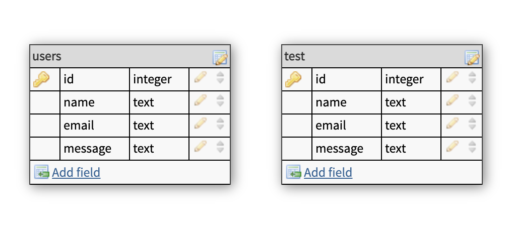

# Installation and Setup Instructions

Clone down this repository. You will need `node` and `npm` installed globally on your machine.

Installation:

`npm install`

Run Test Suite:

`npm test`

Start Server:

`npm start`

To Visit App:

`localhost:8000/api`

<br>

# Endpoints

<details>
<summary>POST: /users - adds a new user</summary>
<br>
Expected Body

```JSON
{
    "name": "Tobi",
    "email": "tobi@mail.com",
    "message": "I would love to use your service"
}
```

Expected Response

```JSON
{
    "id": 1,
    "name": "Tobi",
    "email": "tobi@mail.com",
    "message":"I would love to use your service"
}

```

</details>
<details>
<summary>GET: /users - gets all users</summary>
<br>

Expected Response

```JSON
{
    "results": 2,
    "users": [
        {
            "id": 1,
            "name": "Tobi",
            "email": "tobi@mail.com",
            "message":"I would love to use your service"
        },
        {
            "id": 2,
            "name": "John Doe",
            "email": "john.doe@mail.com",
            "message": null
        }
    ]
}
```

</details>
<details>
<summary>POST: /users/test - adds a new test user</summary>
<br>
Expected Body

```JSON
{
    "name": "John Doe",
    "email": "john.doe@mail.com",
    "message": null
}
```

Expected Response

```JSON
{
    "id": 5,
    "name": "John Doe",
    "email": "john.doe@mail.com",
    "message": null
}

```

</details>

<br>

# Database

<details>
    <summary>Image of Database Layout</summary>
    
</details>
